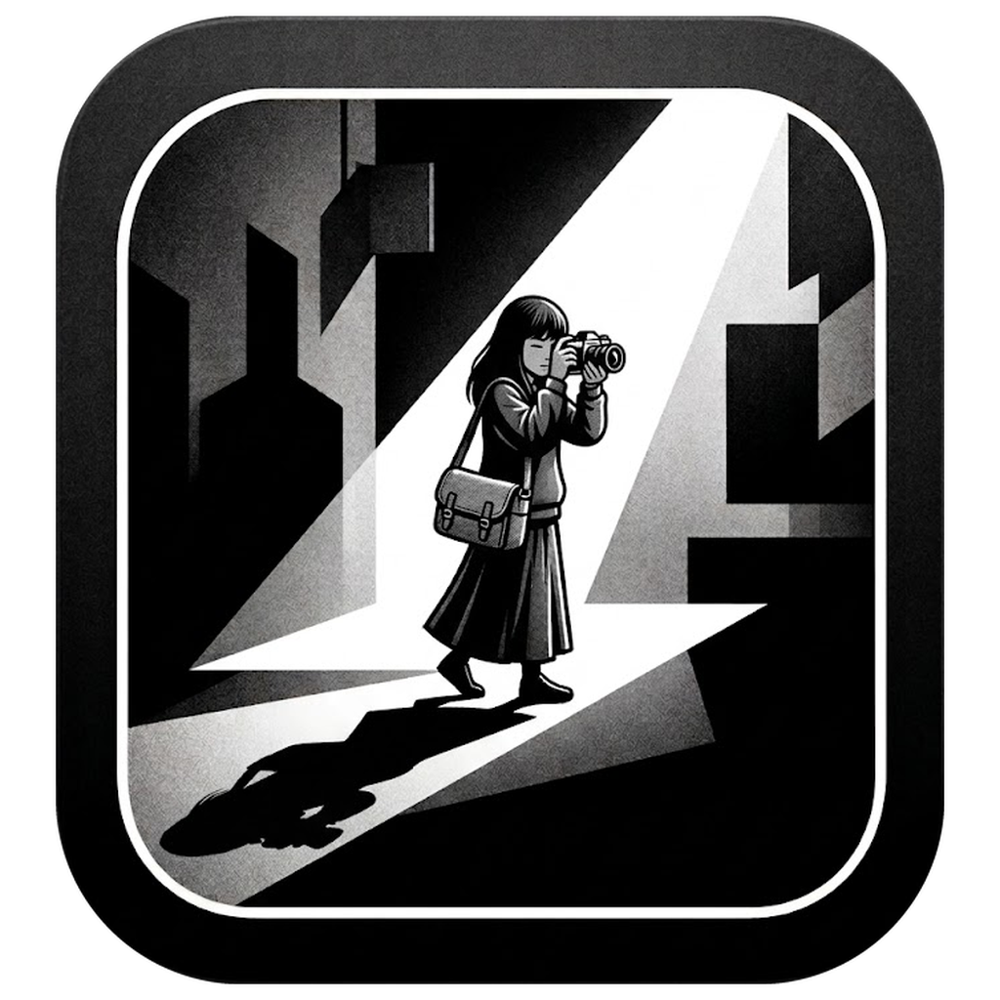

<p align="center"></p>

# Preshot

**简体中文** | [English](README.en.md)

把拍摄想法、参考照片、模特、道具和地点整理成一份可执行的拍摄方案。
Preshot 是 Windows 桌面应用，项目与素材保存在本地，支持中文和英文界面。

## 功能

- **项目管理**：新建、打开、自动保存；支持可折叠分组、拖拽归组和项目名称搜索；可复制为包含独立图片和附件的新项目；多个已打开项目切换时保留编辑状态。
- **自由编排方案**：文字、标题、清单、表格、图片和图片组，以及地点、模特、道具与服装卡片。
- **多栏布局**：任意增加栏位、调整栏宽；栏内图片组等比缩放，支持移动、合并和撤销。
- **图片与截图**：上传、粘贴、嵌入、屏幕区域截图；裁切、缩放和拖动排序。
- **素材库**：保存单张图片、图片组、地点、模特、道具与服装，按描述和关键词检索，在不同项目中复用。
- **导出**：PDF、可编辑的 Word 文档、JPEG/PNG 长图，可选择自动分割。
- **工作区**：明暗主题、中英文切换、专注模式、缩放和可调侧边栏。

## 安装

前往 [GitHub Releases](https://github.com/yucdong/Preshot/releases)，选择版本中的
`Preshot_<版本>_x64_en-US.msi`。安装包适用于 **Windows 10/11 x64**，默认安装到
`C:\Program Files\Preshot`，安装时可更改目录，需要管理员权限；日常使用不需要管理员权限。
从开始菜单启动，桌面快捷方式可以在安装时选择。
`en-US` 表示安装向导语言，应用内仍可自由切换中文和英文。

运行需要 Microsoft Edge WebView2 Runtime，安装向导会在缺失时下载，因此首次安装可能需要联网。
Release 同时提供 SHA-256 校验文件和构建信息；签名与验证情况以该版本说明为准。
若 Releases 尚无安装包，可按照下方步骤从源码构建。

从 0.0.13 及更早版本升级时，请先关闭并卸载旧版，再安装新版；卸载会保留已有数据。
安装完成后可勾选 **Launch Preshot** 直接打开软件。首次启动选择“项目工作路径”，
默认 `%USERPROFILE%\.preshot`，也可指定其他目录；设置、项目列表、`projects` 和
素材库 `library` 统一保存在所选目录下。路径记录保存在用户目录的 `.preshot\profile.json`。
卸载只删除程序文件，保留数据；重新安装会自动读取之前的路径，无需再次选择。
已有用户选择原来的 `.preshot` 即可继续使用旧数据；选择新空目录不会自动迁移旧数据。
备份请包含路径记录、完整工作目录和存放在其他位置的项目。

首次启动会在空工作区创建 **南京长江大桥 · 演示项目**，包含全部组件、双栏与三栏、
图片、虚构模特 A、透明伞、泡泡机及离线附件。已有项目不会被覆盖。
升级用户可复制安装目录中的 `samples\nanjing-bridge` 到自己的项目目录后打开。
[下载源码中的完整样例与使用说明](samples/README.md)。

## 快速上手

1. 点击 **新建项目**，输入项目名称和父目录。例如父目录 `D:\拍摄`、名称“南京长江大桥人像”，会创建 `D:\拍摄\南京长江大桥人像`。
2. 在文档中输入文字，用 `/` 插入标题、清单、图片、图片组、地点、模特或道具卡片。
3. 插入图片时，**上传 / 嵌入 / 截图** 在同一行。点击 **截图** 后框选屏幕区域，图片自动回到文档；按 **Esc** 可取消并重新截图。也可使用 **Win+Shift+S** 截图后，在文档中 **Ctrl+V** 粘贴。
4. 单击图片，或使用组件操作菜单，将内容 **添加到素材库**，填写名称、描述和关键词。也可在素材库中直接创建模特、地点或道具。
5. 点击要插入的位置，再打开 **素材库**。图片组可全部或部分插入，并选择“图片组”或“单张图片”；图片组工具栏也支持从素材库追加图片。
6. 用 **导出** 生成 PDF、DOCX 或长图。长图过长时勾选自动分割。编辑自动保存，也可以按 **Ctrl+S**；关闭项目时会询问是否保存。

## 操作演示

以“南京长江大桥风光人像”为例：从空白项目编写方案，复用提前准备好的素材。场地与模特各含三张参考图，透明伞和泡泡机拖动排列在同一行双栏中；补充构图、曝光、动作和现场清单后，导出并打开 PDF，最后演示创建一个带图片、描述和关键词的素材。
**0.0.24 MSI 安装版实录，约 58 秒**，附中英文字幕，文件选择等步骤已加速。演示包含实际导出并打开的两页 PDF；录制与文件完整性均已验证。详见[验收报告](docs/test_reports/release-0.0.24-review.md)，完整离线样例见 [samples](samples/README.md)。


[完整视频](docs/media/preshot-demo.mp4) · [PDF 示例](docs/media/preshot-demo.pdf) · [演示说明与图片来源](docs/demo/README.md) · [安装包](https://github.com/yucdong/Preshot/releases)

[分项视频教程](docs/demo/material-tutorials.md)：已更新 **33 段 0.0.24 教程**，覆盖素材创建、文档收纳、插入和管理，以及相机照片方向、复制项目、中英文与主题设置。每段不到一分钟，附中英文字幕；32 段使用 MSI 安装版，剪贴板教程 C18 使用隔离的浏览器测试界面。

## 从源码构建

需要 Node.js 22+、pnpm 10、Rust MSVC x64、Visual Studio 2022 C++ 构建工具和 Windows SDK。
在 PowerShell 中运行：

```powershell
git clone https://github.com/yucdong/Preshot.git
cd Preshot
.\init.ps1
pnpm install --frozen-lockfile
pnpm tauri:dev
```

```powershell
pnpm build                 # 构建前端
pnpm production:build      # 检查、构建 EXE 和 MSI
```

安装包输出到 `src-tauri\target\x86_64-pc-windows-msvc\release\bundle\msi`。
本地未配置签名时生成的包会标为不可公开发布；正式发布的签名与校验步骤见
[安装包说明](docs/release/windows-installer.md)。`pnpm dev` 只运行浏览器前端，完整功能请用桌面模式。

[功能文档索引](docs/README.md) · [开发与测试](docs/development/build-and-test.md) · [发布流程](docs/release/github.md)

## 许可证

Preshot 自有源码采用 [MIT](LICENSE)。包含 BlockNote XL 导出器的应用发行版遵循其 GPL-3.0 条款；
详见 [许可说明](docs/release/licensing.md) 和 [第三方声明](THIRD_PARTY_NOTICES.md)。
