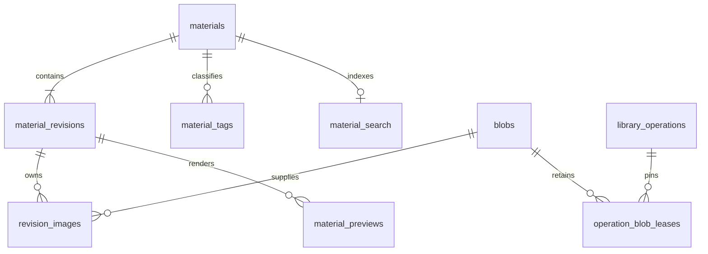

# Global Material Library

**Status: approved; core library, direct creation and isolated editing implemented. Maintenance extensions remain deferred.**

This design adds a per-user, cross-project library of reusable Preshot
components. The production implementation now saves copied originals, provides
Chinese/literal search and read-only previews, manages metadata/favorites/trash,
creates or edits one material on an isolated canvas, and inserts independent editable copies. The review prototype remains
non-persistent. Performance targets below are not measured guarantees.

## Implementation status and deviations

The authoritative deployed DDL is
[`src-tauri/src/library/schema.sql`](../../../src-tauri/src/library/schema.sql),
not the more expansive review-only [schema.sql](schema.sql) beside this document.
Database v4 retains the current payload/detail JSON with relational blob and
image mappings, save/edit receipts, metadata compare-and-swap, and transactional
FTS projection/triggers. Content edits increment a separate content revision;
source blobs remain immutable. Existing v1/v2/v3 libraries migrate atomically.
Portable payloads remain version 1. The proposed full revision/tag/history
schema is not installed. The v3 asset-ownership, purge-receipt, cleanup-outbox and
content-free operation-tombstone tables remain. Version 4 permits atomic combined
metadata/content version increments while retaining identity and metadata-only
mutation guards and byte-identical legacy payload-only receipt hashes. Approved cleanup
resumes on library open; failures surface and can be retried. Existing inserted
copies and unknown pre-v3 orphan files are outside that cleanup scope.

The source image limit follows the existing native 16 MiB limit, not the
proposed 32 MiB budget below. Other active native caps are 128 images,
256 MiB encoded bytes per material, 8192 pixels per source edge and
32 megapixels per source. Cached PNG previews are at most 480 pixels wide,
8192 pixels tall and 2 MiB, retaining their aspect ratio; complete read-only
content remains available separately.

An editing session retains at most 512 original/staged image entries and
512 MiB including undo sources. The committed material still obeys the smaller
128-image/256-MiB limit. Unexpected crash files are preserved and prevent
further staging rather than being silently deleted.

Search rebuilds a changed analyzer projection synchronously in a blocking
native worker under the library lock. It returns ready after completion,
not an intermediate background-rebuild state. Large-library latency targets
have not been benchmarked.

Backup/restore commands, 30-day automatic trash expiry, general object/preview
GC and revision-history browsing are deferred. Soft deletion, restore and
explicit permanent deletion from the recycle bin are implemented. Permanent
deletion never removes project-local insertion copies or recovery receipts.
There is no background expiry or broad filesystem sweep. Later sections
describing those deferred maintenance flows remain design targets, not shipped APIs.

### Unified isolated material editing

The library search row includes **Create material**. A compact keyboard-accessible
chooser offers image group, model, location, prop and clothing; choosing a type
opens this same large editor with empty library metadata and one editable default
component. Images can be imported, captured, cropped and arranged exactly as during
editing. The type is fixed for that draft, and changing the library name does not
change the component's internal title. No project needs to be open.

Creation allocates only session-owned staging through `library_begin_create`,
using an image-free portable seed supplied by the domain. Its response has
`isNew: true`, a future material UUID, blank metadata and both versions zero.
Canonical read/search/edit/commit replies still require a nonempty name and versions
at least one; the adapter permits the zero shape only at this creation boundary.
No dummy library item, FTS entry or save receipt is published before first Save.
Creation manifests use draft format v2, while existing edit manifests remain v1
and readable. Database schema v4 and portable payload v1 are unchanged.
That first save requires `metadataUpdate.expectedVersion: 0` and atomically inserts
the material, owned images, search projection and exact edit receipt with both
versions one. Later saves use fresh normal edit sessions for the same UUID, not
additional creations. Cancelling before first Save leaves no material.

Create and Edit share a fresh exact-name check before every new save, across active
kinds and favorites but excluding trash and, for editing, the current UUID.
A match opens the shared duplicate confirmation with Cancel initially focused.
Creation confirms a new independent record; editing confirms changes to only the
current record. Neither overwrites other same-name materials. The candidate's
metadata, canvas payload and viewport are captured before lookup/confirmation.
Cancel preserves input, failed lookup blocks saving, and late results after
retirement cannot save. An uncertain commit retries its frozen approved request
without another lookup. Names remain intentionally non-unique.
`library_create_conflict` means an earlier operation already published this
draft's UUID. It is not evidence that nothing saved, and must not reset the
attempt into a fresh creation request.

First Save keeps the editor open and switches it into ordinary editing of the
created material. Closing selects the new item in the recent, unfiltered list
and regenerates its committed preview; an unsaved cancellation preserves the
previous browser filters.

The detail preview area has exactly two actions: **Edit material** and **Preview**.
Edit material opens one large modal with a library-information sidebar and the
selected component's production canvas. Name, description, tags and favorite state
are edited beside the content, with one Save/Cancel boundary. Separate favorite,
information editing, refresh and thumbnail-regeneration actions are removed from
this area; deletion/recycle-bin actions and conditional error retries remain.
Preview opens the complete, large read-only production render with original offline
images, not an enlarged low-resolution cached thumbnail. Editing does not open
another project, update recents, or mount project autosave.
Both live and cached image-group previews explicitly include the saved component
name and description above its images. This preview-only presentation option
does not change ordinary long-image export output.

| Surface | Contract |
| --- | --- |
| Header | Show the library name and component kind. Keep content revisions and metadata versions internal; do not expose them in editor or browser details. |
| Scope strip | Explain that only this material is editable and existing project copies are unaffected; display draft/unsaved/saved state in text. |
| Information sidebar | Shared validated name, tags, description and favorite controls. These describe the library record, not the component's internal title. Independently scrollable beside the canvas; stacks above it at narrow widths. |
| Canvas | Reuse the production BlockNote schema and component renderers on the normal paper surface. Retain component fields and internal image editing, not a second set of lookalike forms. |
| Structure | Exactly one fixed block/sidecar identity and kind. No slash insertion, native media insertion, block deletion, duplication, replacement, nesting, block drag or multi-column layout. Reject structural transactions, not merely hide controls. |
| Internal editing | Edit text and fields, add/remove/reorder images, adjust image frames and fit, crop into a new owned image, and undo/redo within this draft. Removing an internal image is allowed; removing the material block is not. |
| Footer | Save material persists both information and content without dismissing the editor. After the first save, Cancel becomes Close. Ctrl+S flushes the focused field and saves outside IME composition. Invalid metadata is focused before persistence; invalid canvas fields also block saving. |
| Dismissal | An untouched draft can close directly. Cancel, the close button, backdrop and Escape ask before discarding unsaved changes. Continue editing returns to the same draft. |
| Modal nesting | Image viewers, crop controls and image-removal confirmation remain inside the owning dialog's portal scope; the topmost dialog handles keyboard focus and Escape. |

Opening allocates a UUID session and pins the original content revision, metadata version and
its immutable image references. Imported originals are copied into bounded,
session-owned JPG/PNG staging, never linked to the user's selected paths.
Cropping creates a fresh staged image and preserves the original for undo.
The renderer uses transient image URLs and a virtual draft plan; none of those
URLs or plan identities become canonical library metadata or project files.

Saving carries an operation UUID, session UUID, one portable payload and
`metadataUpdate: { expectedVersion, metadata }`.
The native boundary accepts only original-session or staged image IDs and
the same component kind. Under the library lock and one SQLite transaction,
it compares both pinned versions, publishes metadata, image mappings and payload,
increments each version exactly once, updates search text, and invalidates the
thumbnail. A metadata-only change in this unified editor also increments both
versions. Payload-only API callers omit `metadataUpdate` and preserve the latest
organizational metadata and its version. Concurrent metadata/content changes or
deletion are conflicts, not implicit overwrites.
The material UUID stays fixed; inserted project copies do not change.

The edit receipt records the exact request and committed result. Retrying a
lost response uses that same frozen metadata/content request, even after draft cleanup; it cannot create
a second revision. An ambiguous result freezes further editing and cancellation
until the user retries confirmation. Forced retirement waits for started work
and retains an unconfirmed draft instead of guessing whether to undo a save.
Definite rejection leaves the draft available for correction or cancellation.

Cancel waits for active image work and deletes only that session's owned files.
After successful commit, the editor stays open and prepares a fresh native draft
from the committed revision for further text/image edits and saves. Each confirmed
save becomes the next draft's undo baseline; its operation ID and pinned versions
are fresh. Zoom mode and scroll position survive draft replacement. Failed cleanup
or draft preparation offers a retry or Close without replaying the commit. A draft
that finishes opening after forced dismissal is retired instead of adopted.

Closing discards only changes since the latest save, refreshes the live library
preview, and regenerates the thumbnail from the latest committed material after
dismissal. No preview is generated from unsaved edits. Preview failures remain
actionable in the library with a preview-only retry. These separate operations
must never submit another content edit. Crashed or unresolved
sessions and unreferenced immutable objects are conservatively retained;
automatic sweeping and a draft-recovery browser are not part of this change.

### Consistent text and image editing

All five material kinds share the same editing interactions, including titles,
descriptions, multi-line information, model measurements and model notes.
These remain schema-constrained native text fields, not nested rich-text
documents. Each field has a visible text caret, I-beam pointer, native mouse
and keyboard selection, readable selection highlight and focus indication.
BlockNote node selection must not hide field selection or intercept copy,
cut and paste. Typing and text undo belong to the focused field; the canvas
toolbar retains the separate draft undo/redo boundary. Tab, IME input and
Ctrl+S keep their existing behavior.

Editable galleries use a normal-flow header, not a negatively positioned
floating toolbar. The title and image count form the first group; Add images,
Capture and any permitted block actions form a separate group. Both groups
wrap without overlapping at narrow widths. Image frames begin below the
complete header. Embedded artifact galleries do not repeat their heading.
Readonly previews and export renderers keep their existing static headings
and must not acquire editing controls. Paper controls remain light and
readable even when the surrounding app shell is dark.

Capture reuses the Windows screen-selection integration. A cancellable status
strip explains that the selected region will be added to this draft. Saving,
closing and other image operations are disabled until capture/import/cleanup
finishes. Cancel capture and Escape cancel only this operation, not the
material editor. A completed PNG is copied through the existing bounded
session import boundary; its temporary capture file is then removed. It never
writes project references or canonical library content before Save material.
Retirement cancels outstanding capture, drains any started native operation
and only then discards the edit session. Late captured/imported results after
cancellation must not appear in the draft. Capture errors and timeout are
explicit failures, distinct from a user cancellation.

The interaction matrix covers each material kind, all native field types,
mouse/keyboard selection, replacement, clipboard operations, text undo,
capture cancellation and completion, save/reopen, header geometry at desktop
widths and zoom levels, and light/dark paper contrast. Synthetic images and
isolated test repositories are used; tests do not capture personal desktops
or modify user material libraries.

## Review package

- [Interactive desktop prototype](../../design_refs/material-library/index.html)
  opens locally in a browser without a build, network, or account.
- [Database DDL](schema.sql) is executable on an empty SQLite database with
  JSON and FTS5 enabled. It is a review artifact, not an application migration.
- The prototype uses invented content and locally generated illustrations.
  Save, insertion, metadata editing, favorites, deletion, and undo operate only
  in page memory. Reload resets them. Its literal search demonstrates UX,
  **not** the proposed native Chinese tokenizer or durable file copying.

## 1. Proposed decisions

| Topic | Recommendation |
| --- | --- |
| Ownership | One library for the current OS user, available across every project in that user's Preshot installation. Not shared across Windows accounts or machines. |
| Component types | Image group, shooting location, model, prop; include clothing through the same mechanism. Clothing inclusion is an explicit scope recommendation. |
| Identity | Stable UUID for each material. Required, editable display name; duplicate names require confirmation when saving a new material. Never use a name as a file path or foreign key. |
| Save | An independent snapshot of the selected component's committed text, image order, individual image frames, crop, and fit mode. Copy actual source bytes into library-owned storage. |
| Insert | Copy to project-owned reference files and allocate fresh block, group, artifact, collection, and image IDs. No linked instances or automatic propagation. |
| Preview | Full-component read-only preview plus a cached screenshot thumbnail. Neither is the canonical content. |
| Search | SQLite FTS5 over Rust-segmented Chinese text, with explicit literal substring matching. No JVM, server, network, embeddings, or OCR in v1. |
| Management | Rename, description, tags, favorite, soft delete, restore and explicit permanent deletion. Save from a project creates a new material; Edit material atomically updates its information and content through an isolated draft. Revision-history browsing remains deferred. |
| Editing context | Single-column documents; one component per row. No outer-component resizing, grouping, or side-by-side insertion. Individual image resizing remains. |

Names and library descriptions are organizational metadata, separate from the
component title and text. Renaming a library material must not rename an
already-inserted card, or change the saved card title accidentally.

## 2. Goals, boundaries, and acceptance scope

The user can save a component once, find it by name or any saved text, inspect
its complete appearance, and insert an editable copy into another project.
Deleting the source project or original selected files cannot break a saved
material. Deleting the material cannot break inserted components.

V1 is not a general file manager, cloud library, shared/team library, template
page system, or arbitrary BlockNote subtree store. Exclude document paragraphs,
native video/audio/file blocks, multi-component selections, nested document
children, agent transcripts, and legacy column documents. Do not silently
discard child blocks: refuse that selection and explain that v1 saves exactly
one supported component.

No automatic publication, upload, library exposure to the assistant, or
expansion of the four closed Preshot agent tools is part of this feature.

### Content captured

| Kind | Canonical component fields | Images |
| --- | --- | --- |
| `imageGroup` | Name and description | Ordered reference images |
| `shootingLocation` | Venue name, address, description | Gallery |
| `modelCard` | Model name/identifier, height, weight, shoe size, additional notes | Samples |
| `prop` | Title and freeform information/source | Gallery |
| `clothing` | Title and freeform information/source | Main gallery only |

Preserve every supported `ReferenceImage` visual field, optional caption,
source dimensions, and original encoded bytes, not a screenshot of the image.
Use the actual persisted, possibly copy-on-write cropped source file. Preserve
the existing meaning of source dimensions and crop without re-encoding it.
Do not retain original project IDs, project-relative paths, source filenames,
selected/hover state, menus, caret, scroll, drag previews, or data URLs.

Outer artifact `layout` and image-group `x`, `width`, `height`, and group
`frameOffsetY` are not portable user layout. Normalize through the active
full-row insertion factory. Do not revive removed container resizing.
Individual-image offsets are different: preserve them.

Clothing's old required `tryOn` storage field is not a supported library
collection. If it contains images, warn before saving that only the visible
main gallery is included; never silently copy hidden images or silently imply
that all legacy content was saved. On insertion, create a fresh empty
`tryOn.gallery` and `expanded: false` solely to satisfy the current v15 schema.
This does not restore the removed UI. Empty supported galleries are valid.

## 3. User experience

### Entry points

1. Global workspace navigation: **Material library** is the sole visible library
   button. With an active document it opens target-bound insertion mode; without
   one it remains accessible in management mode.
2. There is no duplicate document-toolbar insertion button. The equivalent
   slash-menu shortcut remains available without removing the pinned
   new-component commands.
3. Image-group and artifact overflow menus: **Save to material library**. An
   embedded gallery does not get a second ambiguous whole-card save action:
   its parent card menu saves that card. V1 does not save an arbitrary subset.

Runtime labels are Simplified Chinese; the linked prototype contains the copy.
Do not introduce a permanent drawer competing with both project and assistant
panels. The library is a large modal workspace, approximately 1180 by 740px,
bounded by the viewport.

### Save workflow

1. Commit an active field/IME composition, validate it, and wait for in-flight
   image import/crop to finish. If text is invalid, focus the field and stop.
   Do not capture an intermediate drag or resize preview.
2. Capture an immutable component snapshot plus source project and plan
   revision. Open a compact modal with component preview, required name,
   optional description and tags, image count, and logical total source bytes.
3. Prefill the name from the component. Trim and NFC-normalize it; require
   1-80 Unicode code points, no control characters. Allow common punctuation:
   the name never becomes a path. Description is at most 1000 code points;
   at most 12 tags, each 1-24 code points after normalization/deduplication.
4. Show same-name hints while typing, then perform a fresh exact-name lookup
   before saving. Match trimmed NFC names case-sensitively across all active
   material kinds, without favorite filters. Exclude recycle-bin entries.
   The native query filters exact metadata names before pagination, not the
   first page of full-text results. If a match exists, require explicit
   confirmation before copying images or saving. Cancel, Escape, or backdrop
   dismissal keeps the form and restores focus without saving. Confirmation
   creates a new UUID, never overwrites an existing material. Lookup failure
   blocks saving with a retryable error; a result received after dialog closure
   must not initiate a save. This is a save-time prompt, not a unique-name
   constraint or a restriction on concurrent saves.
5. Show phase progress: preparing, copying images, saving content, preparing
   thumbnail. Cancellation before commit leaves no visible material. During
   the short final durable commit, cancellation waits for a definitive result.
6. Confirm success only after canonical text and image bytes are durable.
   A screenshot failure is an explicit partial state: content is saved, preview
   unavailable, retry offered. It is not permission to discard or mislabel the
   material. Source-image failure instead aborts the whole save.

If the project switches or its revision changes before source capture is
prepared, reject as stale and offer refresh. Once all source bytes are safely
staged and the immutable snapshot is pinned, save that disclosed snapshot;
subsequent source edits do not change it.

### Browse, search, and insert

- Header: name, search field, close action. A small subtitle explains that the
  library is local and reusable across projects.
- Type filters: all, image groups, models, locations, props, clothing.
  Also offer favorites. Cards show a full-component thumbnail, name, type,
  image count, tags, and selection state.
- Default order with no query is most recently updated. With a query, relevance
  is default; newest and name are alternatives. Stable ID breaks sort ties.
- Selecting a card opens the right-hand detail pane. Show full component
  preview, image count, logical bytes, library description, tags, and content
  revision. Thumbnails use `contain`, never crop away the text to make a
  photographic cover. Large originals are loaded only for the selected item.
- The preview starts fitted to pane width. **Full preview** opens a scrollable
  larger view; tall components must not be silently clipped. Screenshot
  thumbnails are not expected to make every field legible; live detail is.
- Footer states the project and insertion anchor explicitly. Insert after the
  selected top-level component, or after the top-level ancestor containing the
  caret. Capture user focus/selection, not the editor's default selection.
  If no anchor exists, use the document beginning and label that fact.
- Closing the modal restores editor selection and trigger focus. Opening the
  modal must not replace the stored insertion anchor with its own DOM focus.
- Insert only on **Insert into current document** inside the library. Single-click
  selects; double-click does not silently insert. Disable insert without a project, available source
  images, a supported payload, and a ready document. No cursor is required.
- During copy, keep the preview visible and disable double submission. After
  durable commit, close the browser, focus the new full-row component, and show
  a concise success notification. One undo removes that entire insertion.

V1 inserts one material at a time. Multi-select, drag from library to document,
and linked instances are deliberately excluded.

### Management and less-happy states

| State | Behavior |
| --- | --- |
| Empty library | Explain saving from a component menu; offer a return-to-editor action. Never show a fake import button. |
| No matches | Retain query/filters; offer clear filters and useful query examples. |
| Loading | Fixed-size skeletons, polite busy announcement, no stale actionable selection. |
| DB unavailable/corrupt | Explain failure; retry or backup/repair flow. Keep project editing usable; do not replace the library with an empty DB. |
| Index unavailable/rebuilding | Explicit banner; browse by metadata remains available. Do not silently show zero results as a successful search. |
| Missing source image | List affected image positions; disable insertion/save of that incomplete item, offer retry/restore from backup. Never recover canonical content from its thumbnail. |
| Missing thumbnail | Placeholder and retry; use validated live detail if possible. Insertion remains allowed when canonical files are healthy. |
| Rename/tags | Use the shared editor's information sidebar. Preserve material UUID; the atomic save checks both pinned versions and confirms other active exact-name matches. |
| Delete | The action and confirmation use the Delete label. Existing project copies are unaffected; deleted materials remain recoverable in the recycle bin. Trash is excluded from normal search; automatic expiry is not implemented. |
| Permanent purge | Separate explicit confirmation, unavailable while an operation owns a lease. No promise of secure erasure on SSDs or from backups/WAL. |
| Project switch/anchor deletion | Abort insertion, clean only operation-owned unreferenced files, ask the user to reopen insertion at the intended destination. Never insert into a different project. |
| Concurrent library deletion | A prepared operation pins the revision. A deletion before preparation blocks insertion; a prepared copy can finish from its pinned snapshot. |

Recycle-bin details show both **Restore material** and **Permanently delete**.
The destructive dialog identifies the material, explains that recovery is no
longer possible, and states that inserted project copies are unaffected.
Cancel has initial focus; Escape and backdrop dismiss without deletion.
Only explicit confirmation calls the version-qualified native purge command.
While it is running, disable dismissal and duplicate submission. Failures keep
the confirmation open for an explicit retry; do not report success until
owned-file cleanup completes. On success, refresh the current recycle-bin
query, move back one page if its last item was removed, and focus search.
Material content and metadata versions remain internal and are not displayed
in the details pane or editing header.

The prototype has an explicitly labeled scenario switch for empty, loading,
missing image, index repair, and storage error states; this is not a shipped
settings control.

### Accessibility and layout

Reuse app semantic colors, monochrome surfaces, and restrained accent actions;
do not introduce a marketing hero or decorative large typography. The design
search's editorial recommendations are subordinate to the existing dense
desktop workspace.

Use real buttons, visible field labels, a modal focus trap, inert background,
Escape/backdrop cancellation, and focus restoration. Enter submits forms only
outside IME composition. Tab reaches every action; filters expose pressed state.
Announce result count, selected name, and operation outcome without announcing
every keystroke. Primary control hit areas are at least 40px desktop and 44px
where space permits. Focus is never conveyed by color alone.

At approximately 1000px, reduce thumbnail columns; below 900px, stack detail
under results and keep footer actions visible without covering content. Permit
vertical scrolling at 200% zoom. Honor reduced motion and forced colors.
Desktop app theme follows the existing preference; component preview is a
stable light-paper rendering, visibly framed when chrome is dark.

## 4. Ownership and portable payload

```text
source project                  per-user library                  target project
plan marker + sidecar   --->    material UUID + revision    --->   NEW marker + sidecar IDs
references\0042.jpg      copy   objects\ab\<sha256>.jpg      copy   references\0127.jpg
                               preview cache                     normal editable v15 plan

No hardlinks, source file dependencies, live subscriptions, or cross-owner URLs.
```

The library has its own `payload_version`; it is not a stored mini
`.preshotproj` file. The active manifest wrapper remains schema 1, active plan
v15, document v3. Ordinary insertion needs no plan schema bump because it
creates existing block types. Do not add origin metadata to exact-key-validated
plan objects without an explicit schema change. V1 keeps any operation receipt
outside the plan and has no persisted provenance badge.

Conceptual payload shape (illustrative, not a production TypeScript declaration):

```ts
type MaterialPayloadV1 = {
  format: "preshot-material";
  version: 1;
  kind: "imageGroup" | "shootingLocation" | "modelCard" | "prop" | "clothing";
  component: PortableComponent; // Discriminated by kind; exact field allowlist.
};

type PortableImage = {
  localImageId: string; // Unique inside this revision, not a source image ID.
  // All ReferenceImage fields except id and file, without changing semantics.
};
```

Collections retain their ordered image arrays but no project collection IDs.
Every `localImageId` maps to exactly one `revision_images` row and blob; every
manifest row must be used exactly once by the payload. Several occurrences may
point to the same blob while retaining different frame/crop values. SQL foreign
keys cannot enforce JSON-to-row bijection: the closed-schema domain validator
must enforce it both on write and read.

The library name and tags belong to `materials`/`material_tags`. Card title,
model notes, location address, and gallery description belong to the immutable
revision payload. Raw source paths and arbitrary HTML are not portable content.
Text is rendered as text, never via untrusted `innerHTML`.

During insert, build a bijective mapping for every local identity to a fresh
project identity. Copy each unique source blob once for that insertion, then
allow multiple occurrences to reference that copied file. Subsequent edits use
the existing copy-on-write policy. Separate insertions get independent new
project files in v1; no cross-operation project deduplication shortcut.

Do not call the existing duplicate helper unchanged: it intentionally reuses
project files and appends a copy suffix. Library insertion must import files,
preserve the component's saved title, and remap all identities instead.

## 5. Database and files

```text
%USERPROFILE%\.preshot\
  agent.db                         # Existing metadata-only agent DB, unchanged
  library\
    library.db                     # Canonical material text, metadata, manifests
    library.db-wal / library.db-shm # SQLite-owned transient files
    objects\ab\<sha256>.jpg         # Immutable library-owned JPG/PNG bytes
    previews\<material-id>\         # Regenerable screenshot cache
      <revision>-<render-key>.png
    staging\<operation-id>\         # Bounded, operation-owned temporary copies
    quarantine\                    # Explicitly diagnosed incomplete/corrupt files
```

Only application startup initializes library data, never the MSI. Reuse the
per-user home resolver, not a new Program Files/HKLM or project-owned location.
Do not write anything to this directory while reviewing the proposal.

### Tables and relationships

| Table | Responsibility |
| --- | --- |
| `library_meta` | Schema/index/dictionary generation metadata |
| `materials` | Internal FTS rowid, public UUID, kind, display metadata, favorite/trash, current content revision, optimistic metadata version |
| `material_revisions` | Immutable versioned payload, checksum, creation time |
| `blobs` | SHA-256 of encoded bytes, MIME, length and decoded dimensions; path derived from digest |
| `revision_images` | Revision-local image occurrence to immutable source blob |
| `material_tags` | Canonical display tags and normalized deduplication keys |
| `material_previews` | Revision/render-key cache state, relative path and error code |
| `material_search` | Rebuildable normalized raw text and segmented token fields |
| `material_fts` | External-content FTS5 index maintained by SQL triggers |
| `library_operations` | Durable idempotency/recovery intent and result receipt |
| `operation_blob_leases` | Retain existing blobs during copy, preview, or backup |



`materials.current_revision` references a revision belonging to the same UUID.
The circular head/revision foreign keys are deferred within one transaction.
Content revision is immutable; metadata changes increment `metadata_version`.
This review-only history schema describes immutable historical revisions.
The deployed database-v4 material editor instead updates the current payload
with a monotonic content revision and durable edit receipts; it does not expose
the proposed history browser.

### File/storage policy

- Store binary images outside SQLite to avoid large DB/WAL churn and base64
  allocation. Text and structured payload **are** in SQLite, as requested.
- Hash exact copied bytes, verify MIME by decoding, and deduplicate only within
  this library. Do not hash filenames, decoded pixels, or thumbnails.
- SHA-256 is content identity, not an encryption or access-control mechanism.
  Derive paths natively; never trust renderer-supplied paths, extensions, or
  hashes. Verify an existing digest object's size/hash before reusing it.
- No hardlinks or symlinks. Reject traversal, reparse escapes and unsupported
  formats. Open/copy from validated project-local files using existing safe
  native patterns; verify opened-file identity/containment, not just a string
  prefix or an earlier path check.
- Logical material bytes count each unique referenced blob once. Actual
  library storage is the union of retained blobs plus caches; distinguish the
  two in UI rather than summing duplicate occurrences.
- Proposed caps: 128 image occurrences/material, 32 MiB encoded bytes/image,
  256 MiB encoded unique bytes/material, 1 MiB payload JSON, and 200,000
  searchable text code points/material. Reject oversize saves with an
  actionable message; never silently truncate stored content.
- Decode serially/bounded concurrency: at most 32 megapixels/image, 8192px
  per axis and a 256 MiB working decoded-image budget, always subject to any
  stricter native/project limits. Stream disk-to-disk; do not send a 256 MiB
  batch through renderer IPC. These proposed budgets require measurement.
- Insertion also obeys existing plan limits (512 artifact records, 128 images
  per artifact collection, 2048 total artifact images) and current image-group
  and project file contracts. Validate the full target plan before publication.

### Connection and migrations

Use existing native `rusqlite` with bundled SQLite. On **every** library
connection: foreign keys ON, bounded busy timeout, WAL, and `synchronous=FULL`
for the content store. Do not copy the agent store's NORMAL durability setting
without considering these different contents. Verify actual bundled FTS5/JSON
capabilities in the packaged Windows executable; a development Python SQLite
check alone is insufficient.

Migrate under an exclusive library operation lock. Back up before a
destructive schema migration; refuse newer unsupported versions rather than
reinitializing. Never enable SQLite extension loading for tokenization.

## 6. Transactions and failure recovery

SQLite transactions do **not** make filesystem copies atomic. Use a durable,
idempotent native operation state machine. One OS-level cross-process library
write/maintenance lock serializes publication, deletion, and GC; DB reads stay
available. A project-scoped writer lock and revision/hash checks separately
serialize project commits. Use one documented lock order (library, then project)
where both are needed, and do not hold either across user interaction.

### Save: file-first, DB publication-last

1. Allocate operation UUID and intent; persist phase `preparing`. The intent
   describes expected material ID, source snapshot hash, image occurrences,
   expected blobs, candidate payload, and pending metadata. It is private
   library content, never agent metadata or logs.
2. Under source revision validation, stream source images into staging; bound
   sizes, decode/verify type/dimensions, hash and flush. No visible material yet.
3. Atomically publish immutable blob objects on the same volume, with durable
   file handling supported by existing Windows primitives. Persist phase
   `files_ready`. Never replace a different object at the digest path.
4. In `BEGIN IMMEDIATE`, insert blobs, material head, revision, image manifest,
   tags, extracted search row (trigger updates FTS), preview `pending`, and
   operation `committed` receipt. Deferred FK validation occurs at COMMIT.
5. Render the preview from this **committed revision**. Publish its file first,
   then atomically set its cache row ready. Preview failure stores `failed`
   and a bounded error code and is separately retryable.

Crash before step 4 can leave unreferenced immutable files, never a visible
material that points to uncopied bytes. Restart matches operation receipts and
checks file hashes. It either finishes a completely staged valid candidate
idempotently or marks it failed and reclaims its unreferenced files after a
grace period. Ambiguous or corrupt intent is quarantined, not guessed.
Retrying a committed operation returns its original material ID.

### Insert: one coordinated durable project mutation

1. Capture target project ID, provider generation, current plan revision/hash,
   and insertion anchor. Block when retained agent-recovery conflicts prevent
   plan mutations. Pin library material/revision and validated blobs using an
   operation lease.
2. Native staging prepares copies without changing the document. A project-local
   recovery journal records operation ID, base manifest hash, exact owned
   relative paths, expected target hash, and intended marker/sidecar IDs.
   Do not put target absolute paths into agent metadata.
3. Allocate names through the project reference-file allocator under the project
   writer boundary. Never predict the next `####` filename in React.
   Build/validate the complete next v15 plan with fresh identities and an
   existing full-row layout factory. Publish the prepared project files.
4. Revalidate project generation, full-plan revision/hash, and anchor. If any
   changed, abort rather than rebase behind the user's back.
5. Through a new provider/service coordinated insertion command, durably save
   the full manifest, then publish marker + sidecar + one undo entry together.
   Do not insert a marker first and wait for images or autosave to catch up.
   This coordinated command is required new work, not an existing guaranteed
   API of `createGroup`/`createArtifact`.
6. Mark project-local journal committed and persist the library receipt.
   If receipt update fails after manifest commit, report/reconcile that state;
   never roll back valid content or insert again merely because the response
   was lost. Manifest hash plus intended IDs and journal determine completion.

Crash after files but before manifest leaves only operation-owned orphans.
Crash after manifest but before receipt is recognized as an already-applied
insertion. If current manifest matches neither base nor expected target,
retain a conflict and require recovery; do not overwrite newer edits.
Project-local recovery runs when that project is reopened even if the global
library is offline.

Undo/redo references keep inserted files alive while history can restore them.
GC must check the current manifest, history leases, pending native operations,
and recovery journals. Undo never deletes the source library material.
Ordinary future edits/autosave/export use project-local bytes only.

### Delete, GC, backup, and recovery

Soft deletion changes the metadata and search visibility, not the blob files.
On purge after explicit approval or documented 30-day trash expiry, remove
revision rows; then reclaim a blob only if neither retained revisions nor
operation leases reference it. Do not maintain an easily drifting refcount.
Derive reachability in SQL. Purge and physical deletion run under the same
maintenance lock; a new save cannot race object reuse with deletion.

Lease expiration is not proof of process death. Renew heartbeats for active
operations; release stale leases only after recovery confirms no live owner
and no unresolved project journal. Failed operations with unresolved receipts
remain retained. Surface storage retained by conflicts.

Back up using the SQLite backup API plus the exact reachable immutable objects
from a pinned snapshot, with preview files optional. Copying only `library.db`
while WAL is active is **not** a backup. Write a backup manifest with hashes
and schema/version, verify it, then publish the backup directory atomically.
V1 backup/restore can be a maintenance flow; never claim the prototype performs it.

Restore into staging and validate before swapping the library while handles are
closed. Keep a rollback copy. Corrupt canonical JSON/image data requires a
backup or explicit removal; a search rebuild cannot reconstruct it.

## 7. Full-text search and Chinese segmentation

### Alternatives

| Option | Chinese support | Runtime and consistency cost | Decision |
| --- | --- | --- | --- |
| Apache Lucene + SmartChineseAnalyzer | Included Simplified Chinese/mixed English segmentation dictionary | Lucene 10.3.1 requires Java 21+; bundle/manage JVM plus separate index lifecycle and bridge to Rust | Capable, disproportionate for v1 |
| SQLite FTS5 `unicode61` alone | Unicode tokenization is not Chinese word segmentation; continuous Chinese text is not reliably searchable by internal words | Already-close native dependency; simple DB transactions | Insufficient alone |
| FTS5 + `jieba-rs` pre-segmentation | Offline embedded Chinese dictionary; domain lexicon can be bundled | Rust crate and dictionary; search projection and source commit in one SQLite transaction | Recommended |
| FTS5 trigram alone | Literal substrings, not semantic Chinese words; MATCH misses strings shorter than three Unicode characters | Extra index space; short-query scan still required | Optional later acceleration, not sole search |
| Tantivy + Chinese tokenizer | Rust search engine, BM25 and richer search; Chinese via configured/third-party tokenization | No JVM, but separate index commit/recovery from SQLite | Reconsider if measured scale/ranking requirements justify it |

Do not assert a universal MB startup/installer saving or a relative latency
without benchmarking. SQLite is public domain; `jieba-rs` and Tantivy identify
MIT licensing, and SmartChineseAnalyzer documents its dictionary's Apache 2
license. Exact crate versions, embedded dictionaries, transitive licenses, and
notices must be reviewed and pinned during implementation.

### V1 indexing contract

1. Extract name, library description, tag text, type labels, and **all supported
   component text** from canonical fields, including model notes, location
   address and image captions. Never index source paths, IDs, hidden try-on
   records, binary EXIF text, or thumbnails.
2. Keep original strings untouched. For the search projection only, apply NFKC,
   deterministic case folding, and whitespace normalization. Do not promise
   pinyin, Traditional/Simplified conversion, synonyms, or typo correction.
3. In Rust, use a pinned embedded `jieba-rs` dictionary and search-mode
   segmentation; retain Latin words/model codes through consistent analyzer
   rules. A bundled photography lexicon improves domain terms without any
   download. Limit analyzer output and total query work.
4. Store space-separated token streams in `material_search.*_tokens`. The
   built-in FTS5 tokenizer can then index separated Chinese terms. This avoids
   exposing a dynamically loaded custom SQLite tokenizer.
5. Name/tag/body projection and FTS update in the same content/metadata
   transaction. Search has no normal eventual-consistency interval.

Search-mode overlapping tokens are a bag of searchable terms, **not** original
document positions. V1 does not expose FTS phrase/NEAR syntax or use FTS
highlight offsets against raw content. Compute safe literal highlights from
raw text with normalized-to-original offset mapping; for token-only matches
show a field excerpt without fabricated character highlights.

### Query semantics

- Search after an IME-safe 180ms debounce; cancel superseded requests and ignore
  stale responses. Native API receives plain user text, never SQL/FTS syntax.
- Maximum 128 code points and 16 whitespace-delimited chunks. Whitespace
  separates required concepts: each chunk must match somewhere in the material.
- For each chunk: match either its literal normalized substring in one raw
  field, **or** all normal-mode segmentation tokens of that chunk in the
  corresponding search-mode indexed material. Different chunks may match
  different fields. OR these two routes per chunk, AND the chunks.
  If a chunk produces no lexical tokens (for example, punctuation only), that
  lexical branch is false, not a vacuously true match-all. Empty input means
  metadata browsing, not an empty MATCH expression.
- Compile FTS expressions from normalized tokens with literal escaping and
  bound parameters. `OR`, quotes, `*`, `%`, `_`, and parentheses typed by the
  user are data, not operators; parameterizing SQL alone does not neutralize
  the separate MATCH query language.
- Literal matching uses bound `instr(normalized_field, :chunk) > 0` predicates.
  Evaluate name, tags and body separately so strings cannot span artificial
  field separators. This includes single-/two-character Chinese terms and
  proper-name fragments that tokenization misses.
- Do not limit the scanned rows before evaluating predicates and ranking.
  Run cancellable scans on a native worker, with type/trash filters first.
  Return 50 ranked rows/page and use request-generation/snapshot-aware cursors.
  At the proposed 10,000-material target, benchmark the cost of the literal
  union over all candidates. Add trigram acceleration if measurements require
  it, with explicit short-query behavior retained.
- Rank exact material name, then name/tag phrase hits, then weighted lexical
  BM25 (name 8, tags 5, body 1), then literal-only content matches. Smaller
  FTS5 `bm25()` values rank better. Break ties by updated time then stable UUID.
  Do not sum incompatible trigram and lexical BM25 scores.

Example cases for implementation (the prototype illustrates only literals):

| Query (Unicode escapes in this English document) | Required outcome |
| --- | --- |
| `\u590d\u53e4` (retro) | Match inside a longer title and body, not only an entire Chinese sentence token |
| `\u68da` (studio character) | Literal one-character matches are supported |
| `\u591c\u666f \u9713\u8679` (night + neon) | Both concepts required, possibly in different fields |
| `\u5f90\u6c47` (place-name fragment) | Match even when the tokenizer treats the full address as one name |
| `35mm` / `35MM` | Case-insensitive normalized code match |
| `OR`, `"`, `%`, `*` | No syntax injection, crash, or implicit wildcard |
| Full-width letters/digits | Search-normalized match; stored display text unchanged |
| An unsupported synonym/pinyin query | May have no match; no semantic-search claim |

### Rebuild and performance targets

`library_meta.index_generation` covers extraction, normalization, tokenizer,
dictionary and lexicon versions together. An upgrade marks search unavailable
with an explicit banner, keeps metadata browsing working, and rebuilds derived
rows/index from canonical records under a bounded writer operation. Use a
temporary generation and atomic switch or a single bounded transaction; never
mix query and index tokenizers. Interrupted rebuild rolls back/resumes safely.

`INSERT INTO material_fts(material_fts) VALUES('rebuild')` rebuilds only FTS
from the token rows. A new tokenizer requires re-extracting those rows first.
The trigram-only index, if added later, is also derived and disposable.

Targets for a documented Windows x64 SSD test machine: first 50 results within
200ms warm / 500ms cold at 10,000 representative materials, excluding the
180ms typing debounce; opening an already-cached first screen within 500ms;
no UI-thread file copying/segmentation. Measure both common and one-character
queries, 100/1000/10,000 records, long notes, and cancellation. If targets fail,
revise budgets or index design before release rather than reporting success
from the mockup.

## 8. Preview rendering

Reuse the shared read-only BlockNote schema, artifact renderers, and offline
asset readiness/cleanup patterns, not a screenshot of the selected editor DOM.
Construct an export-only one-block v15 plan with transient IDs resolved from the
pinned revision and library asset handles. No project write is needed.

Render at the existing 900px export outer width with stable light-paper colors
and bundled fonts. Include the entire component, with no editor controls,
selection, shadows that imply selection, or resize/drag overlays. Preserve
committed frame/crop/fitMode and image order. Audit the remaining image-group
geometry in the shared export path before claiming exact parity with full-row
editor behavior; this proposal does not assume that cleanup is already complete.

Use the pinned same-origin `modern-screenshot` path for ordinary bounded
thumbnail capture. Key cache by material UUID, immutable content revision,
renderer/layout/font generation, width, and theme. Name/tag-only edits do not
need a new screenshot because organizational metadata is outside the component.

For content within an 8192px height / 8-megapixel capture budget, rasterize the
whole component and derive a maximum 480px-wide thumbnail capped at 2 MiB.
Use a separate live scrollable full preview for reading small fields. If the
component exceeds the raster budget, retain a labeled partial thumbnail and
use live/virtualized detail for the entire component rather than truncate
canonical content or allocate an unbounded canvas. The UI must say that the
thumbnail is partial, and the full detail must expose all images and text.

Decode assets with bounded concurrency, wait for fonts and images, cancel
stale jobs, release object URLs/workers/DOM roots in `finally`, and use an LRU
preview cache (proposed 256 MiB). Missing cache is repairable; missing source
bytes are not. Never modify independent PDF, DOCX, and long-image user-export
pipelines or relax CSP for remote capture services.

## 9. Integration plan

| Layer | Proposed responsibility and existing seam |
| --- | --- |
| `domain/library` (new) | Closed portable payload, extraction, validation, search semantics, operation state machines and ports; no React/DOM/Tauri |
| `features/library` (new) | Browser, save dialog, metadata form, preview states; invoke domain services |
| Existing editor | Overflow actions and slash shortcut; register the shell library entry's current-document target; capture user selection or prepend; one coordinated library insertion command |
| `infrastructure/library` (new) | Narrow Tauri adapters and read-only preview adapter; browser prototype adapter explicitly non-durable |
| `src-tauri/src/library` (new) | SQLite migrations, confined paths, streaming copies, file verification, leases, locks and durable native receipts |
| App composition | One per-user library service, separate from project and agent stores |

Illustrative ports: `searchMaterials`, `getMaterial`, `prepareMaterialSave`,
`commitMaterialSave`, `cancelOperation`, `prepareMaterialInsert`,
`finalizeMaterialInsert`, `updateMaterialMetadata`, `setMaterialDeleted`,
`requestMaterialPreview`. These are not arbitrary read/write filesystem
commands. Inputs are IDs, expected versions, bounded typed fields, disclosed
snapshots, and opaque prepared-operation handles. Native code resolves paths.

The browser adapter may provide deterministic fixtures for integration tests,
but must explicitly report that global durable library operations require
desktop. Do not return success-shaped persistence fallbacks.

### Verified source seams and caveats

- `src/domain/plan/canvas/blockDocument.ts:94-161` defines current collections,
  artifact kinds, notes and retained clothing storage; lines 3-7 define the
  relevant schema versions and artifact caps.
- `src/domain/plan/canvas/models.ts:68-92` defines source/frame/crop/fitMode;
  lines 124-131 define image-group description and ordered images.
- `src/features/plan/blocknote/ArtifactBlockView.tsx:351-427` contains the
  artifact overflow menu to extend.
- `src/features/plan/blocknote/BlockNoteProjectCanvasProvider.tsx:163-262`
  creates/clones records; lines 1410-1476 reconcile pending/detached sidecars.
  These are useful mechanisms, not a complete durable library insertion API.
- `src/features/plan/blocknote/BlockNoteDocumentEditor.tsx:500-545` composes
  custom insertion entries.
- `src-tauri/src/workspace.rs:262-320` resolves and initializes per-user roots.
- `src-tauri/Cargo.toml:24` already uses bundled `rusqlite`;
  `src-tauri/src/agent_store.rs:648-705` demonstrates connection configuration,
  but `agent.db` must remain metadata-only.
- `src/infrastructure/longImage/longImageExportSurface.tsx:271-320` provides
  mount/readiness/cancel/cleanup patterns;
  `src/features/plan/blocknote/export/LongImageExportSurface.tsx:34-129`
  assembles the shared read-only rendering contexts.

Some older active design documents still describe columns or outer-card resize.
For this proposal, the latest single-column/no-outer-resize user decision and
current code take precedence. This design-only change does not rewrite those
historical implementation documents or claim production behavior has changed.

## 10. Implementation slices after approval

1. Freeze portable schema, supported types, budgets and user-visible copy.
   Prototype remains separate from production.
2. Add domain serialization/remapping and native SQLite/file lifecycle,
   including migration, hash validation, crash recovery and packaged FTS smoke.
3. Add save dialog/actions, named snapshots, library browsing and Chinese search.
4. Add pinned full preview and atomic copy-on-insert with undo/redo and cleanup.
5. Add metadata/favorite/trash/restore, index repair and backup/restore.
6. Run the acceptance matrix below, then update production architecture,
   testing, localization, licensing and feature status documentation.

### Acceptance matrix

| Area | Required cases |
| --- | --- |
| Content round trip | All five kinds, empty galleries, multiline notes, optional captions, null measurements, cover/stretch, crop and repeated blob occurrences |
| Identity/ownership | Two inserts have distinct IDs and project copies; source deletion, library deletion and library rename do not affect inserted plans |
| UI contracts | Save required name, same-name confirmation and cancellation, failed/late name lookup, tags, query/filter selection, full preview, missing images, IME, keyboard/Escape/focus restore, narrow viewport, dark/forced colors |
| Search | Chinese phrases, 1/2-character queries, place names, mixed codes, hostile syntax as literals, normalized highlight mapping, AND chunks, deterministic pagination |
| Consistency | JSON/manifest bijection, cross-material revision FK, metadata CAS conflict, FTS insert/update/delete/rebuild and rollback |
| Native failures | Disk full/access denied/corrupt image/hash collision-path mismatch, crash at each file/DB phase, lost responses, cancellation, concurrent save/delete/GC |
| Project boundary | Project switch and edits during staging, deleted anchor, two windows, retained agent conflict, exactly one manifest/undo boundary, no orphan marker |
| Recovery | Crash before/after manifest commit, conflicting newer edit retained, history file leases, library unavailable on project reopen |
| Export | Inserted content uses ordinary independent PDF/DOCX/long-image paths and visible order, with no library dependency |
| Privacy/packaging | Offline operation, no arbitrary path commands, no assistant disclosure/logged content, notices/dictionary shipped, installer does not own library data |
| Budgets | Proposed count/byte/decode/query/preview limits enforced before allocation; no unbounded batch IPC |

### Review decisions

The approved core uses five supported kinds (including clothing),
independent-copy insertion, duplicate display names with confirmation, direct
creation and unified metadata/content editing on an isolated single-component canvas,
SQLite with Chinese segmentation rather than Lucene, and the two-pane
library/save-dialog interaction. Automatic trash expiry and the other
maintenance extensions listed at the top are not active.

## Research references

1. [SQLite FTS5 tokenizers, external content, triggers, rebuild and BM25](https://www.sqlite.org/fts5.html)
2. [Lucene 10.3.1 system requirements (Java 21+)](https://lucene.apache.org/core/10_3_1/SYSTEM_REQUIREMENTS.html)
3. [SmartChineseAnalyzer and included dictionary](https://lucene.apache.org/core/10_3_1/analysis/smartcn/org/apache/lucene/analysis/cn/smart/SmartChineseAnalyzer.html)
4. [jieba-rs: Rust Chinese segmentation, embedded dictionary and MIT license](https://github.com/messense/jieba-rs)
5. [Tantivy: Rust search, tokenizers, BM25 and Windows support](https://github.com/quickwit-oss/tantivy)
