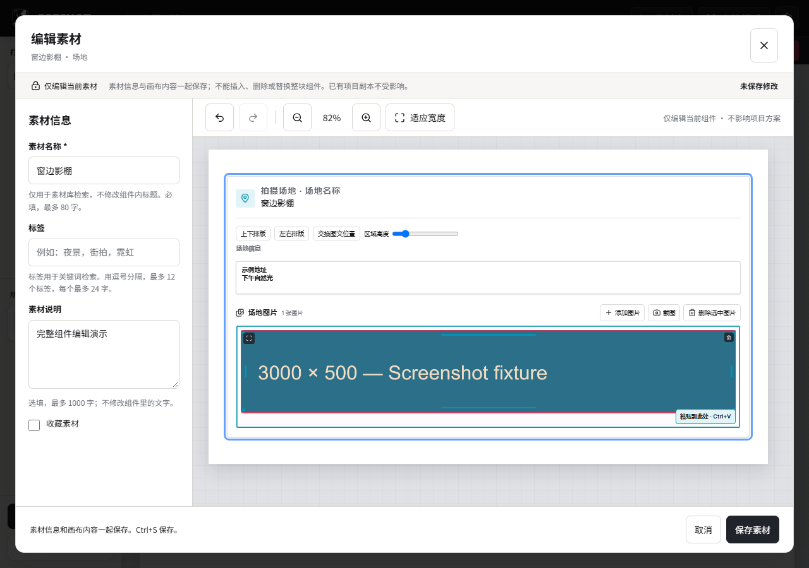
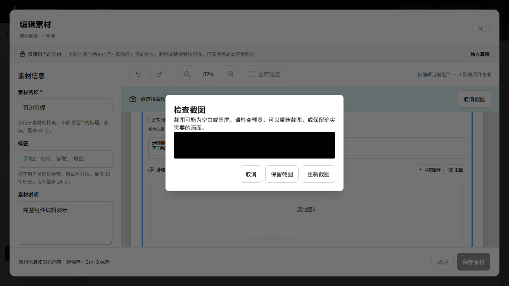

# Buglist 2: screenshot review and image deletion

Date: 2026-09-30. Scope: implementation and isolated regression verification.
The original `test-results/buglist2.md` and its image are preserved. See the
[investigation](buglist2-investigation.md) for the original reproduction.

## Changes

- New file imports and captures receive the available gallery width in document
  coordinates, including canvas zoom and column scaling. Only their default
  frame is reduced, proportionally; original dimensions/pixels and existing
  saved frames/crops remain unchanged. The 3000-by-500 reproduction fits.
- Selected images keep their corner delete action visible. A separate gallery
  toolbar action also makes existing oversized or failed-preview images removable.
- Plain Delete on the selected image or its controls opens the existing deletion
  confirmation. It does not delete the surrounding component. Text fields,
  composing/repeated/modifier keys and active gestures are excluded. Removal
  uses the existing history path and moves focus to another image or gallery
  control; cancel, undo and redo preserve the image identity.
- Native capture validates RGBA dimensions and checks that clipboard sequence
  and owner remain stable while reading. Fully transparent or uniformly dark
  captures return a bounded preview hint (at most 320 by 200 pixels). Detailed
  dark photos are not flagged. The original pixels are never rewritten.
- Suspicious captures wait for Cancel, Retake screenshot or Keep screenshot
  before importing. Retry first drains owned PNG cleanup; cleanup errors stop
  retry. Material edit leases forward both the review callback and cancellation.
  Review dialogs remain outside the busy canvas, support keyboard focus/Escape,
  and cancel when their owning project becomes inactive or unmounts.
- New UI messages have Chinese and English translations.

## Verification

Focused Vitest coverage includes image frame defaults, visible deletion actions,
keyboard exclusions, material capture/review/history, session retirement,
inactive project review cancellation, native-response validation, cleanup
failure, cancellation during review, provider capture/save and image mutation
races. Native screenshot tests check pixel-exact PNG encoding, bounded warning
previews, ordinary/detailed dark images, invalid RGBA, capture cancellation,
owned temporary files and independent persistent media.

Browser acceptance uses the production material editor in Edge with an injected
synthetic native capture boundary. It never reads the live system clipboard or
changes the developer's library. Scenarios cover:

1. A wide location screenshot at 960- and 1280-pixel viewport widths: frame fits,
   toolbar action is visible, Delete prompts, cancel preserves, confirm removes,
   undo/redo works, text Delete stays native, and save/reopen retains the image.
2. A black capture: no image is staged before review; Escape cancels; the next
   capture starts; Retake opens another capture; explicit Keep inserts once.
3. Existing normal capture/cancel/save/reopen flows for image groups, locations,
   models, props and compatible clothing materials.
4. Creating a fresh location material with imported and captured images, saving,
   reopening, editing and previewing the same material.

Evidence is stored under `media/buglist2/`; Playwright output goes only to
`.preshot-build-cache/buglist2-*`, preserving the user's bug reports.



[960px viewport](media/buglist2/wide-capture-960px.png)



Results:

| Check | Result |
| --- | --- |
| Focused Vitest suites | 174 distinct cases passed across 11 files; 60 affected UI/lease cases rerun after final changes |
| `cargo test --manifest-path src-tauri/Cargo.toml screenshot --lib` | 15 passed |
| Edge screenshot/deletion/review and five existing capture flows | 8 passed |
| Edge fresh location creation, update and preview | 1 passed on rerun; initial attempt was interrupted by a Vite page reload before creation |
| `pnpm typecheck` | Passed |
| ESLint on changed capture/view/lease files and acceptance fixtures | Passed |
| `pnpm i18n:check` | Passed |
| `pnpm docs:check` | Passed |

Browser commands:

```powershell
$env:PRESHOT_E2E_PORT = '1453'
pnpm exec playwright test e2e/buglist2-capture.spec.ts e2e/material-editing-interactions.spec.ts --grep screenshot --output .preshot-build-cache/buglist2-final-20260930
pnpm exec playwright test e2e/material-create.spec.ts --grep 'creates \u573a\u5730' --output .preshot-build-cache/buglist2-create-20260930-r2
```

## Remaining native verification

The user's original black PNG and derivative were unavailable, and the actual
Windows snipping failure has not been reproduced. These changes provide result
validation and a recovery flow; they do not establish the cause or prove that
Windows will never produce a black capture. No clipboard-owner process allowlist
was added, since Windows capture brokers vary by OS version.

Real installed-app capture of the original target and Windows display scaling
at 100%, 150% and 200% remain manual acceptance items. No MSI was built or
installed for this task.
