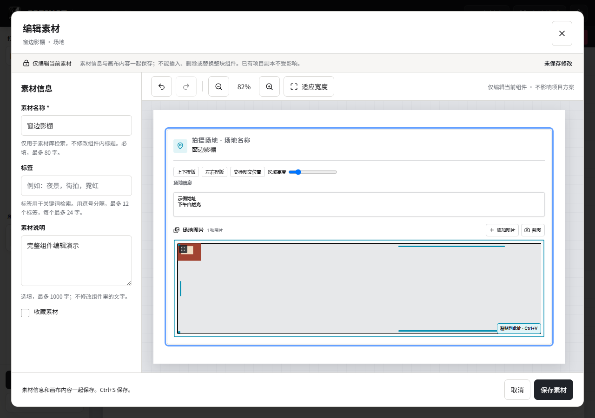

# Buglist 2: screenshot and image deletion investigation

Date: 2026-09-30. Scope: investigation only; no production behavior changed.

The report in `test-results/buglist2.md` describes a black screenshot while
creating a location material, an unavailable image-delete button, and a request
for Delete to open the image deletion confirmation. The original report and
its screenshot were preserved.

## Findings

| Issue | Evidence and status |
| --- | --- |
| Delete action disappears on a wide screenshot | Reproduced in the real material editor with an isolated synthetic capture boundary. |
| Delete key does not request image deletion | Reproduced with the image focused. No confirmation dialog appears. |
| Captured image appears black | Reported screenshot confirms the symptom; the original capture PNG and its derivative were not available for comparison. The Windows capture failure itself has not been reproduced. |

### Wide image hides the delete action

`MaterialContentDraft.addImages` uses `defaultImageFrame`: an initial height of
240 and width of `240 * aspectRatio`, without an available-gallery-width cap.
For a 3000-by-500 screenshot this produces a 1440-by-240 frame.

`ImageGroupBlockView` uses unscaled gallery layout outside columns. The layout
wraps subsequent images but does not fit an oversized first image. Its inner
container has `overflow: hidden`. The delete button is attached to the image's
top-right corner, with opacity zero until hover or button focus. Selection
alone does not make it persistently visible.

At a 1280-by-900 browser viewport and automatic canvas zoom, the reproduction
measured an image width of 1178.8 CSS pixels and a gallery width of 798.3 pixels.
The clipping container ended at x=1164.1, while the delete button started at
x=1542.7. The button existed in the DOM but was not pointer-accessible in the
initial view. Playwright's automatic scrolling could eventually expose it;
that is not evidence that a user can see the action before scrolling/focusing.

Measurements: [reproduction.json](media/buglist2/reproduction.json).

Relevant sources:

- [MaterialContentDraft.ts](../../src/features/library/MaterialContentDraft.ts)
- [plan.ts](../../src/domain/plan/canvas/plan.ts)
- [documentImageGroupLayout.ts](../../src/domain/plan/canvas/documentImageGroupLayout.ts)
- [ImageGroupBlockView.tsx](../../src/features/plan/blocknote/ImageGroupBlockView.tsx)

### Keyboard deletion is missing

The image button's `handleKeyDown` delegates drag keys and handles Enter for
opening the image. It has no Delete handler. The existing delete button already
opens `ConfirmDialog` through `pendingDelete`; confirmation calls the owning
controller's `removeImage`. Material structure locking deliberately rejects
document-level deletion, so the editor cannot supply this missing image action.

Recommended behavior: when focus belongs to the selected image or its controls,
plain Delete opens the existing image confirmation once. Stop propagation so
the surrounding document block is not deleted. Ignore composing/repeated keys,
modifier combinations, active drag/resize, unavailable editors, and text fields.
Cancel preserves the image; confirm uses the existing image removal and history
path. Restore focus to a surviving image or the gallery and preserve undo/redo.

### Black capture: what is and is not established

The production chain is:

1. `start_screen_capture` starts Windows `ms-screenclip:` and records the
   clipboard sequence, with observers for Escape and overlay dismissal.
2. `poll_screen_capture` accepts an image whenever the clipboard sequence differs
   from its starting value. `arboard` prefers registered PNG data and otherwise
   decodes DIBV5, returning RGBA.
3. `write_capture_png` writes those pixels to an owned temporary PNG.
4. The material repository imports that file into the current draft and prepares
   a display derivative. The temporary capture is then removed.

The capture writer checks byte length but not image content. An opaque black
image is valid image data and can proceed normally. The code also does not
confirm a capture-specific producer or recheck that the clipboard sequence
remained stable across the image read. These are gaps in attribution and result
handling, not proof that either caused this particular screenshot.

The orange icon in the user's screenshot indicates stretch mode. Stretch uses
100% image width and height and does not change the source file, replace pixels,
or add a black fallback. No evidence currently supports blaming stretch mode.

To localize the failure, compare the original capture PNG, the generated preview,
and a direct Windows snip of the same target. Inspect dimensions, alpha, color
range, and successful browser decode. If the original is already black, inspect
the Windows capture/clipboard stage. If only the derivative is black, inspect
native preview decoding. If both are correct, inspect image resolution/rendering.

Relevant sources:

- [screenshot.rs](../../src-tauri/src/screenshot.rs)
- [screenshot_observer.rs](../../src-tauri/src/screenshot_observer.rs)
- [captureScreenImage.ts](../../src/infrastructure/plan/captureScreenImage.ts)
- [original_image.rs](../../src-tauri/src/original_image.rs)
- [imageView.ts](../../src/domain/plan/canvas/imageView.ts)

## Recommended change boundaries

1. Fit newly imported/captured image frames within the available gallery width,
   preserving aspect ratio, original pixels and resolution. Use the current
   gallery width with zoom accounted for, rather than a fixed document width.
   Keep an explicit selected-image delete action in the visible gallery toolbar
   so existing oversized images also remain removable. Do not silently rewrite
   existing saved crop/frame settings or change drag layout semantics.
2. Route Delete through the same confirmation and removal path as the button.
   Cover gallery, location/model/prop cards and isolated material editors while
   preserving native text editing and whole-block keyboard behavior.
3. Harden capture attribution and stable clipboard reads without changing the
   clipboard or consuming unrelated copied images. Treat unusually uniform/dark
   captures as suspicious, with preview/retry/cancel and an explicit keep option,
   rather than rejecting every black image: intentional dark photos are valid.
   Retain the current cancellation, temporary-file ownership and late-result
   suppression guarantees. Image-load failures should expose retry/removal, not
   an unexplained blank frame. Final native correction depends on the pixel-level
   comparison above; replacing the capture implementation is not yet justified.

## Verification performed and remaining coverage

- 52 existing Vitest tests passed across `tauriMaterialLibrary.capture.test.ts`
  and `ImageGroupBlockView.test.tsx`. Those passing tests do not cover the two
  newly reproduced UI failures or real Windows black-capture pixels.
- An isolated Edge reproduction used the production material editor and its
  existing synthetic capture boundary, returning a valid 3000-by-500 PNG.
  Image decode succeeded, Delete opened no prompt, and the delete button lay
  beyond the clipping area. No page errors occurred.
- Only the synthetic boundary's image dimensions were changed for this diagnostic.
  No real library mutations or desktop/system clipboard operations were performed.
- The diagnostic runner is local at
  `.preshot-build-cache/buglist2-investigation/repro.mjs`.

Before accepting a fix, add failing regressions for wide/short captures, narrow
card layouts, selected-button visibility and keyboard confirmation/cancel/undo.
Include text-field Delete, active gestures, busy editors and project switching.
Native capture coverage should include late PNG publication, unrelated clipboard
changes, transparent/dark/corrupt images, cancellation followed by another snip,
and real Windows capture with 100%/150%/200% scaling. Synthetic capture tests alone
cannot establish that the reported Windows black-screen capture is fixed.
