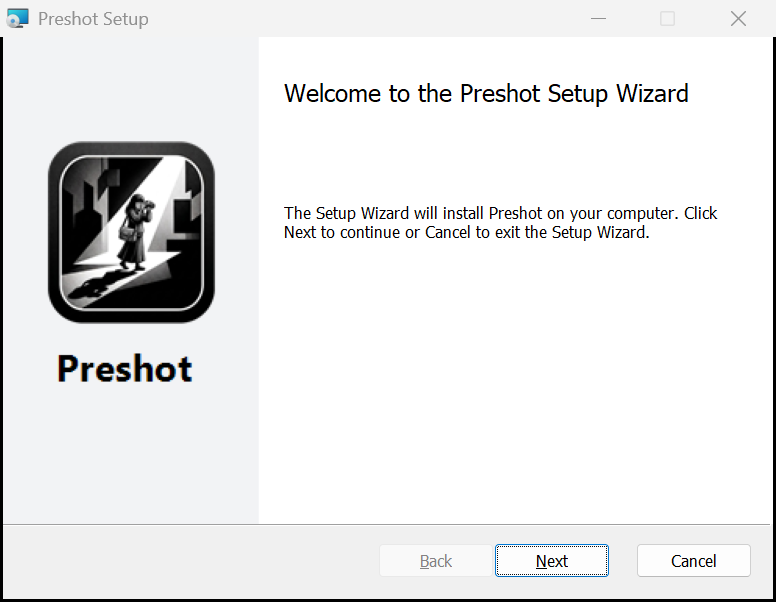
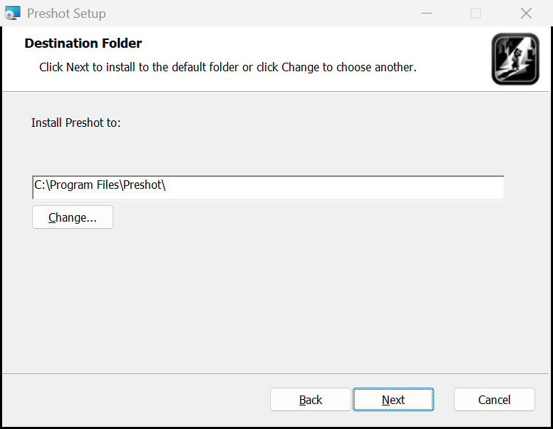
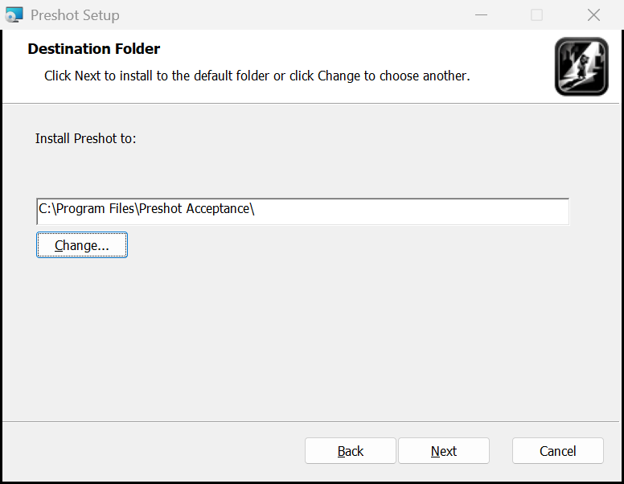
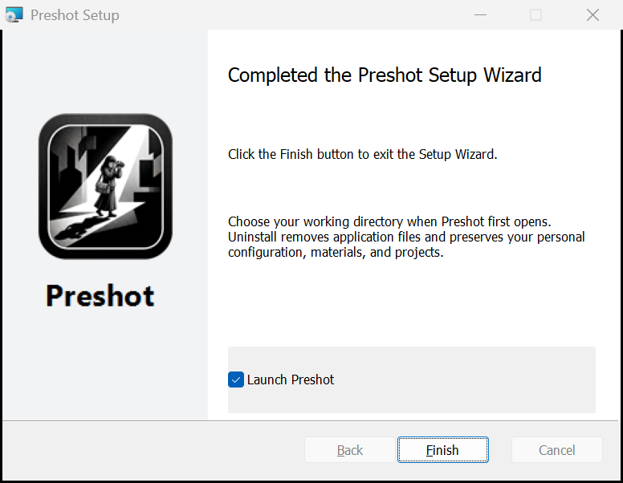
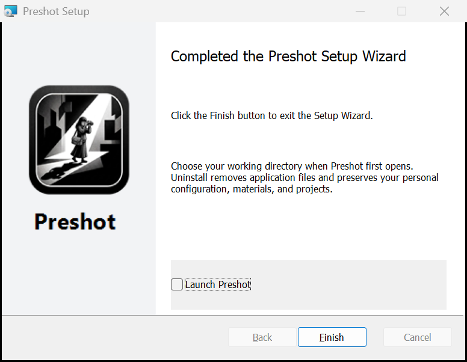
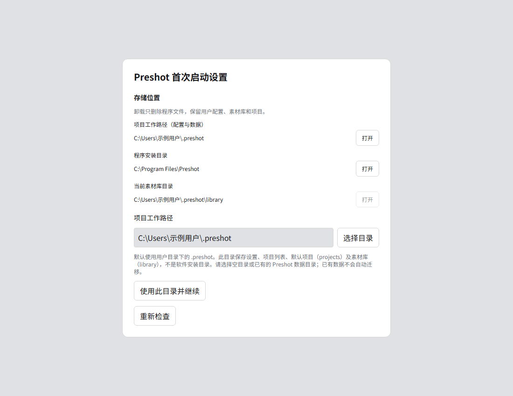
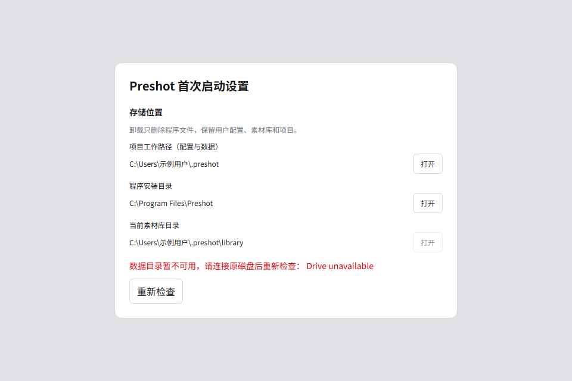

# Working-directory and MSI acceptance — 0.0.15

Date: 2026-09-29. Scope: the user-requested local installation, first-launch
working-directory selection, personal data retention, uninstall and reinstall.
The local install/uninstall operations were explicitly requested; independent test
profile/data directories protected the existing personal workspace.

## Result

The final MSI installed successfully both in the default `C:\Program Files\Preshot`
and in `C:\Program Files\Preshot Acceptance`, selected through **Change...**.
It displays the project logo on its welcome, directory and completion pages.
The completion checkbox launches the editor as the desktop user (native token
query: `TokenIsElevated = 0`); clearing it exits without launching the application.

The installed app selected a custom Unicode data directory through its real
first-launch UI. `profile.json` remembered it. Startup created its library and
copied the complete offline sample project into its `projects` subdirectory.
A new image material named **installation regression image (Chinese name)**, including an imported original,
Chinese tags and a description, saved and closed its creation dialog normally.
After reinstalling into a different application directory, the app reopened the
same project registrations and material library without asking for setup again.
The full material preview opened without a missing-image or loading error.
A second project, **installation acceptance project (Chinese name)**, used the selected default project parent.
Changing the theme to dark wrote `settings.json` inside the chosen data root.

The final uninstall/reinstall cycle compared SHA-256 for **30 retained files**,
including the profile locator, settings, project manifests, library database,
material originals and copied sample media: **0 missing or changed files**.
MSI install/uninstall exit codes were all 0. Installer-owned executables were
absent after uninstall. The final machine installation is in the default Program
Files directory; test data remains isolated under the build cache.

## Defect found and fixed

The initial installer launch test exposed Windows access-denied while opening
the desktop user's token with assignment rights. The launcher now opens the
shell token with query/duplicate rights, duplicates a primary token, constructs
the desktop user's environment and creates the editor before exiting. No Tauri
initialization or profile writes occur in the elevated launcher. The rebuilt
MSI's actual finish-page action was retested successfully, including the native
non-elevated token check. The initial unsuccessful package is not the final
artifact listed below.

## Automated coverage

- Full Rust suite: 360 passed, 6 intentionally ignored worker fixtures; the
  subsequently added missing-library-metadata case also passes in the final
  focused profile suite (5 passed).
- Affected frontend/application/workspace/MSI suites: 50 passed; final focused
  setup and MSI rerun: 21 passed.
- Edge first-launch/custom-data-directory/bilingual-settings and missing-drive
  integration: 2 passed. Platform ports are injected in this browser suite.
- Typecheck, lint, i18n, documentation checks and production PowerShell harness
  passed. Compiled MSI ownership, architecture, registry and launch-action
  contracts passed for the final artifact.
- Native temporary-root tests cover default-root adoption, custom-root identity,
  missing/corrupt/changed data roots, unrelated/nested directories, interruption
  recovery, retained library originals/drafts/receipts and workspace migration.

## Actual local workflow

| Step | Action | Observed outcome |
| --- | --- | --- |
| Install | Default directory shown; select custom directory through Change | Correct destination in MSI log, HKLM registration and installed files |
| Launch | Leave Launch Preshot checked and finish | Installed executable opens; process token is not elevated |
| First run | Select `custom data directory (Chinese name)` in the isolated test profile | Locator published; library and starter project use this root |
| Data | Import a real bundled bridge JPEG as an image material | Saved metadata, original and generated preview; editor closes |
| Reinstall | Uninstall, install at another application path, reopen same test profile | Setup skipped; project and material reopened |
| Settings | Save dark theme and create a second project | Both files are under the chosen data root |
| Retention | Uninstall/reinstall again | 30 file hashes unchanged; locator still authoritative |
| Launch opt-out | Clear finish checkbox | No Preshot process is launched |
| Final state | Install to default Program Files path | Final 0.0.15 installed; personal workspace not reconfigured |

## Screenshots and evidence limits

These are captures of the real MSI windows, not HTML mockups:

The desktop session was disconnected. Midscene's desktop health check failed
with an invalid screen handle; Win32 window capture and Windows UI Automation
provided the actual installer/application interaction fallback. WebView GPU
content could not be captured reliably with PrintWindow, so application pixel
layout evidence comes from the separate Edge integration screenshots; actual
installed-app claims above are supported by native UI state, database/filesystem
results and process-token inspection, not by an invented app screenshot.

Local detailed evidence is under `.preshot-build-cache/profile-acceptance`:
MSI logs, UI Automation state captures, file-hash baselines, locator/settings,
material data and process-token results. Build log:
`.preshot-build-cache/profile-msi-build-final.log`.

Alternate administrator credentials, other Windows accounts, clean machines
without WebView2, and cross-version upgrades require a separate VM matrix. They
are not implied by the same-user local reinstall results. The package is unsigned.

## Final artifact

- `src-tauri/target/x86_64-pc-windows-msvc/release/bundle/msi/Preshot_0.0.15_x64_en-US.msi`
- SHA-256: `6b0cf61a7a6534bbbcdbc91c94e0d045c377ecb79e51eace4154dc333a42e0e3`
- ProductCode: `{48170252-1842-4F38-B833-6F0DF537740E}`
- UpgradeCode: `C91F6BC2-1F30-4D43-B878-3D09737227F2`
- The adjacent checksum and release manifest describe this exact final build.
- Installed executable SHA-256: `0d3d9905fd80a08ddd043936e0c06d2b423f3ea27ddfd3e7507b745b2ebdd1e3`.
  It differs from the standalone release EXE only in Tauri's expected three-byte
  bundle-type marker (`UNK` to `MSI`); the remaining bytes match exactly.
